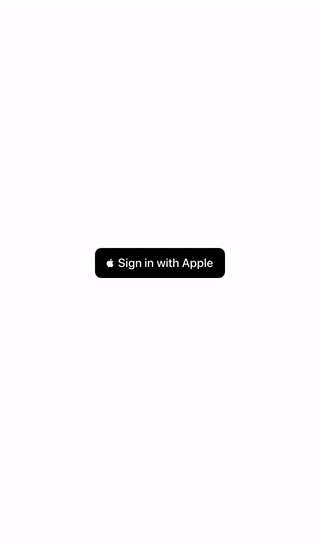

# [Sign in with Apple](https://developer.apple.com/sign-in-with-apple/) Example App [](https://twitter.com/intent/tweet?text=Want%20to%20implement%20Sign%20in%20with%20Apple%20in%20your%20iOS%20app%3F%20Learn%20how%3A&url=https%3A%2F%2Fgithub.com%2FGetStream%2Fsign-in-with-apple-swift-example)



This is the completed iOS and Node.js projects following the [Adding Sign in with Apple to your iOS App](https://getstream.io/blog/sign-in-with-apple-swift/) tutorial. You should read it before trying to run this project as it contains many instructions not present in this README.

## About this repository

This repository is built on top of this [iMessage Clone repository](https://github.com/getstream/stream-imessage-clone). By cloning that repository and following the tutorial, you will arrive at a similar state to this one.

## Setup

You should place your Stream and Apple credetials in [`backend/index.js`](backend/index.js#L7-L16). Make sure to also change the IP Address in [`iMessageClone/Authentication.swift`](iMessageClone/Authentication.swift) with the IP and port where the backend is running.

### Dependencies

Dependencies are included, but if you need to make any changes, use CocoaPods in the root folder:

```bash
$ pod install --repo-update
```

And for the backend, use Yarn or NPM in the `backend` folder:

```bash
$ yarn install
```
or

```bash
$ npm install
```

## Helpful Links

- [Build an iMessage Clone with The Stream Chat iOS SDK](https://getstream.io/blog/build-imessage-clone/)
- [Stream Chat iOS Tutorial](https://getstream.io/tutorials/ios-chat/)
- [Stream Chat iOS Repo](https://github.com/GetStream/stream-chat-swift)
- [Stream Chat iOS Docs](http://getstream.io/chat/docs?language=swift)
